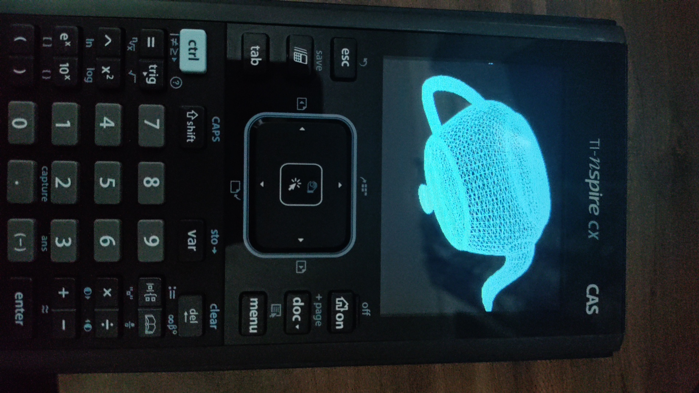

# TI-calculator 3D model loader and visualizer

Suzanne model from Blender

Utah Teapot model

To add 3d models, copy the contents of the .obj file to the main.cpp file and create a new const char* (NAME HERE). The Utah Teapot is around the max verticies/faces/edges the CX Cas calculator can usually handle.
